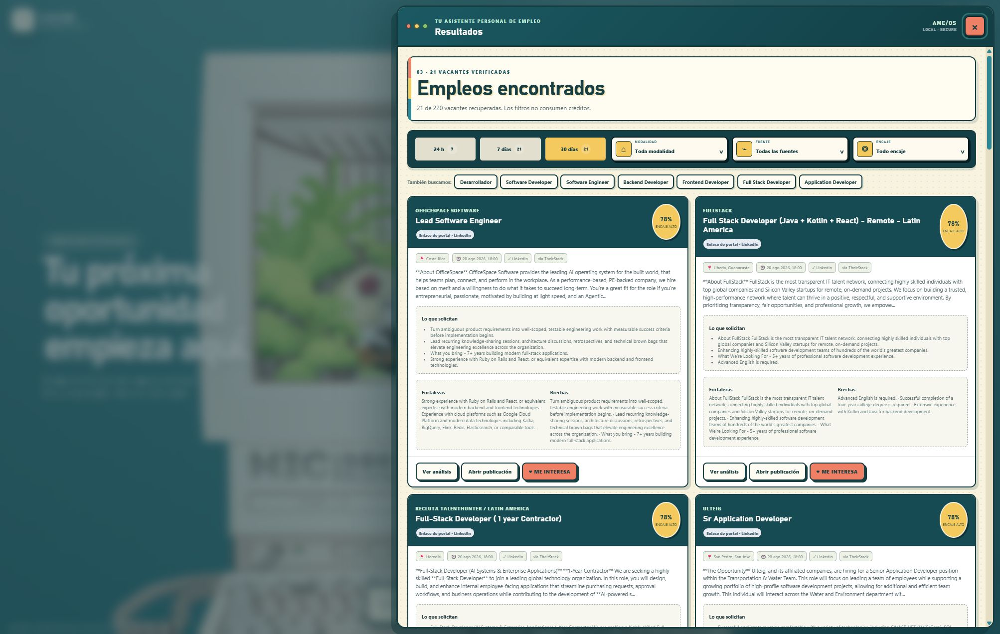
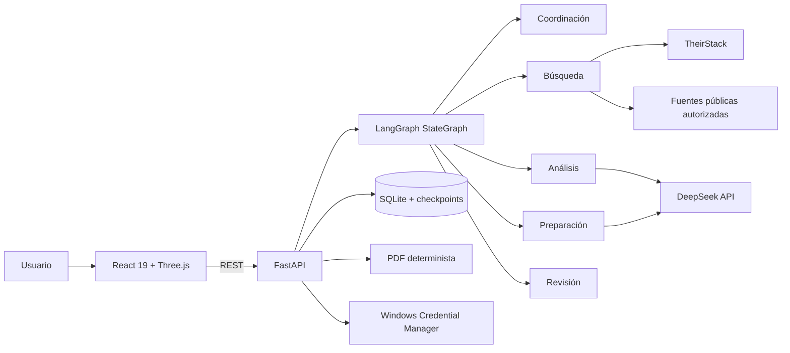

# AmeWork

> Orquestador multiagente personal para descubrir empleos, comparar cada vacante con tu experiencia real y preparar entrevistas sin inventar información ni postular automáticamente.

[](backend/pyproject.toml)
[](backend/job_orchestrator/main.py)
[](backend/job_orchestrator/workflow.py)
[](frontend/package.json)
[](frontend/package.json)
[](LICENSE)


## ¿Qué es AmeWork?

AmeWork es una aplicación web local, bilingüe y orientada a Windows. Su objetivo es convertir una búsqueda laboral dispersa en un flujo claro:

1. Importas un CV en español y otro en inglés.
2. Revisas y confirmas los hechos profesionales extraídos.
3. Escribes un rol, por ejemplo `QA`, `Desarrollador` o `Data Analyst`.
4. AmeWork consulta vacantes de Costa Rica y oportunidades remotas compatibles.
5. Filtras el mismo conjunto por últimas 24 horas, 7 días o 30 días.
6. Comparas cada puesto con el CV del idioma correspondiente.
7. Guardas las oportunidades que te interesan y generas una guía de entrevista en PDF.

La aplicación **no rellena formularios, no envía correos y no presenta candidaturas**. La decisión y el envío siempre pertenecen al usuario.



## Funcionalidad principal

| Área | Qué hace |
| --- | --- |
| **Mi CV** | Importa CV español e inglés, extrae experiencia, habilidades, educación y logros, permite corregir cada hecho y exige confirmación antes de analizar vacantes. |
| **Buscar empleos** | Amplía el rol en español e inglés y recupera resultados de los últimos 30 días. TheirStack es la fuente principal; conectores públicos autorizados funcionan como respaldo. |
| **Resultados** | Muestra puesto, empresa, ubicación, modalidad, fecha, requisitos, fuente, tipo de enlace y encaje. Los filtros de 24 h, 7 días y 30 días no repiten la búsqueda ni consumen créditos adicionales. |
| **Ver análisis** | Explica fortalezas, brechas y cambios recomendados al CV, usando exclusivamente experiencia confirmada. No crea logros, métricas ni conocimientos inexistentes. |
| **Me interesa** | Guarda la vacante de forma idempotente y genera una guía de entrevista determinista, revisada y descargable en PDF. |
| **Mis intereses** | Conserva vacantes seleccionadas, análisis y guías para retomarlos después. |

## Una orquestadora visible, cinco funciones internas

La escena muestra únicamente a Ame en su terrario. Por debajo, un `StateGraph` de LangGraph coordina cinco responsabilidades tipadas; no son conversaciones ficticias ni se expone razonamiento privado.

| Función | Responsabilidad | Límite |
| --- | --- | --- |
| Coordinación | Valida el estado del perfil, dirige el flujo y solicita decisiones humanas. | No busca ni puntúa. |
| Búsqueda | Amplía el rol, consulta fuentes y conserva procedencia. | No recibe datos personales del CV. |
| Análisis | Relaciona requisitos con hechos profesionales confirmados. | No inventa ni modifica el perfil. |
| Preparación | Propone preparación de entrevista basada en evidencia. | No presenta la candidatura. |
| Revisión | Audita fechas, enlaces, respaldo y contenido final. | No aprueba en lugar del usuario. |

Las fechas, deduplicación, filtros, ranking, validación de enlaces y renderizado PDF son procesos deterministas. DeepSeek sólo participa en propuestas estructuradas que luego se validan con esquemas Pydantic y reglas de respaldo.

## Arquitectura



### Tecnologías

- **Backend:** Python 3.12, FastAPI, LangChain, LangGraph, Pydantic y SQLite.
- **Frontend:** React 19, TypeScript, Vite, Three.js y React Three Fiber.
- **Búsqueda:** TheirStack como proveedor principal; Jobicy, Remotive, Remote OK, Himalayas, We Work Remotely y ATS configurables como respaldo.
- **Análisis:** DeepSeek mediante una API key almacenada fuera de la base de datos.
- **Documentos:** ReportLab y PyPDF, con trazabilidad entre afirmaciones y hechos confirmados.
- **Entorno:** `uv` para Python y `pnpm` para el frontend.

## Fuentes y procedencia

Cada resultado mantiene campos separados para:

- proveedor de datos;
- portal o dominio de origen;
- URL de origen;
- URL final de candidatura;
- tipo de enlace: empresa/ATS o portal;
- fecha exacta de publicación y fecha de recuperación.

TheirStack puede devolver ofertas originadas en LinkedIn, Indeed, Glassdoor, Computrabajo, ATS y páginas corporativas. AmeWork **no controla sesiones, cookies ni credenciales de esos portales y no los scrapea directamente**. “Todos los empleos” significa todos los registros recuperables desde las fuentes habilitadas durante esa ejecución, no todo Internet.

## Instalación en Windows

### Requisitos

- Windows 10 u 11.
- Python 3.12.
- [`uv`](https://docs.astral.sh/uv/).
- Node.js 22 o superior.
- `pnpm` 11.19.0, fijado en [`package.json`](package.json).
- Una API key de TheirStack para la cobertura principal.
- Una API key de DeepSeek para análisis y preparación.
- Tesseract OCR, únicamente si vas a importar documentos escaneados.

### Inicio rápido

```powershell
git clone https://github.com/AruHonshou/AmeWork.git
cd AmeWork
Copy-Item .env.example .env
./scripts/bootstrap.ps1
./scripts/dev.ps1
```

Después abre [http://127.0.0.1:5173](http://127.0.0.1:5173), entra en **Configuración** y valida TheirStack y DeepSeek por separado. Las claves se guardan en Windows Credential Manager y nunca regresan al navegador.

El script de desarrollo levanta:

- frontend en `127.0.0.1:5173`;
- backend en `127.0.0.1:8765`.

Consulta la guía completa en [Primeros pasos](docs/getting-started.es.md) o el [manual bilingüe en PDF](output/pdf/manual-career-orchestrator.pdf).

## Privacidad y seguridad

- Los CV originales, SQLite, checkpoints, logs y PDF personales permanecen en el equipo y están excluidos de Git.
- DeepSeek recibe únicamente hechos profesionales confirmados y la descripción necesaria de la vacante; se eliminan correo, teléfono y dirección.
- TheirStack recibe el rol y los filtros de mercado, nunca el CV.
- Las API keys se guardan como credenciales de Windows; no aparecen en `.env`, SQLite, eventos, logs, checkpoints ni PDF.
- Toda descripción externa se trata como contenido no confiable y no puede cambiar instrucciones ni activar herramientas.
- El servicio escucha sólo en `127.0.0.1` y usa un token de sesión local.
- No existe fallback silencioso hacia otro proveedor.

Antes de hacer público un fork, revisa también [SECURITY.md](SECURITY.md) y el [modelo de amenazas](docs/privacy-threat-model.es.md).

## Pruebas

```powershell
./scripts/test.ps1
./scripts/validate-assets.ps1
pnpm build
```

La suite cubre contratos, conectores simulados, paginación, caché, deduplicación, fechas frontera, URLs, credenciales, redacción de datos, reanudación, filtros, reducers, interfaz, fallback 2D y generación del PDF. CI utiliza servicios falsos deterministas: no consume créditos ni necesita claves reales.

## Estructura del repositorio

```text
AmeWork/
├── backend/                 # API, dominio, agentes, grafo, conectores y pruebas
├── frontend/                # React, escena 3D, paneles y pruebas
├── assets/                  # Manifiesto, licencias y procedencia visual
├── docs/                    # Documentación técnica ES/EN e imágenes del README
├── output/pdf/              # Manual público bilingüe
├── scripts/                 # Instalación, desarrollo, pruebas y validaciones
├── .github/workflows/       # Integración continua
├── .env.example             # Configuración segura sin secretos
├── THIRD_PARTY_ASSETS.md     # Atribución del modelo 3D
└── LICENSE                  # Apache-2.0 para el código
```

## Documentación

- [Índice de documentación](docs/README.md)
- [Arquitectura](docs/architecture.es.md)
- [Contratos y eventos](docs/contracts-and-events.es.md)
- [Fuentes y términos de servicio](docs/sources-and-tos.es.md)
- [DeepSeek y Credential Manager](docs/deepseek-windows.es.md)
- [Evaluación](docs/evaluation.es.md)
- [Solución de problemas](docs/troubleshooting.es.md)
- [Cómo contribuir](CONTRIBUTING.md)

## Licencias y atribución

El código de AmeWork se distribuye bajo [Apache License 2.0](LICENSE).

La escena **Smol Ame in an Upcycled Terrarium** fue creada por **Seafoam** y se conserva bajo **CC BY 4.0**. El GLB mantiene su licencia propia y no queda relicenciado por Apache-2.0. Procedencia, checksum y permiso de redistribución están documentados en [`assets/manifest.json`](assets/manifest.json), [`THIRD_PARTY_ASSETS.md`](THIRD_PARTY_ASSETS.md) y [licencias](docs/licensing.es.md).

Este es un proyecto fan no oficial, sin afiliación ni respaldo de COVER Corporation, hololive production ni las personas representadas. No incluye voces, canciones ni imitación de personalidad.

---

English technical documentation is available from the [documentation index](docs/README.md).
